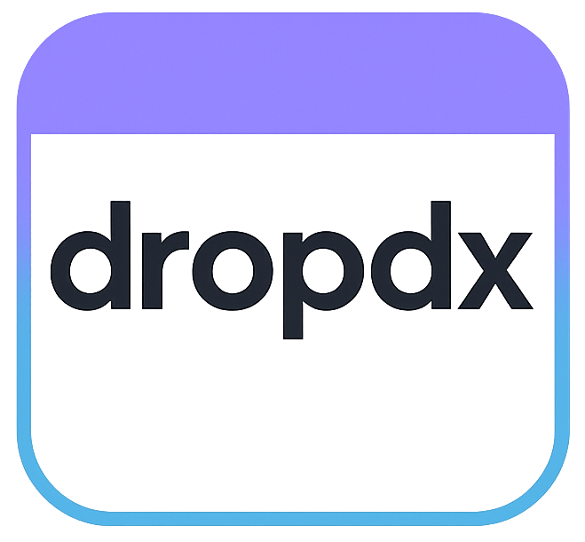

<!-- markdownlint-disable-next-line -->

  <!-- markdownlint-disable-next-line -->
  <picture>
    <!-- markdownlint-disable-next-line -->
    
  </picture>

  <!-- markdownlint-disable-next-line -->
  <h1 align='center'>dropdx start-packs</h1>
  <!-- markdownlint-disable-next-line -->
  
Your custom configurations, organized and ready to drop

---

# 🚀 dropdx Starter Packs

Welcome to the `dropdx` Starter Packs repository! This is your go-to resource for **pre-configured environments and system setups** designed to seamlessly integrate with your `dropdx` installation.

---

### ✨ What Are Starter Packs?

In the world of `dropdx`, **Starter Packs** are curated collections of configuration files, scripts, and dependencies tailored for specific operating systems or development environments. Think of them as blueprints for instantly setting up your personalized workspace, ready to be managed by `dropdx`.

These packs leverage the power of `dropdx` to keep your system organized, consistent, and portable. Instead of manually configuring every aspect of a new machine, you can deploy a Starter Pack to quickly get up and running with a standardized and well-structured setup.

---

### 🌟 Why Use Starter Packs?

* **Rapid Setup:** Dramatically reduce the time and effort required to configure a new machine or environment.
* **Consistency:** Ensure a uniform development or system environment across all your machines or for your team.
* **Best Practices:** Benefit from pre-configured setups that follow common best practices for organization and efficiency.
* **Modularity with `dropdx`:** Each pack is designed to integrate cleanly with `dropdx`'s modular management system, making it easy to further customize or update.

---

### 📦 Repository Structure

This repository is primarily organized into two key directories:

* **`blueprints/`**: Contains generic, reusable templates or foundational configurations. These aren't necessarily full "starters" themselves but serve as building blocks or reference points for creating new ones.
* **`starters/`**: Houses the ready-to-deploy Starter Packs, each named after the target environment (e.g., `ubuntu`, `macos`). Each directory here represents a complete, ready-to-use configuration set for `dropdx`.

---

### 🚀 Getting Started

To utilize a Starter Pack:

1.  **Ensure `dropdx` is installed** and configured on your system.
2.  **Select your desired Starter Pack** from the `starters/` directory (e.g., `starters/ubuntu`).
3.  **Follow the instructions within the chosen Starter Pack's `README.md`** (if available) to integrate it with your `dropdx` setup. This typically involves copying its contents into your `dropdx` home directory and sourcing relevant files.

For example, a Starter Pack might contain:
* Shell configurations (aliases, functions, completions)
* Program settings (e.g., `nvim` or `vscode` configs)
* OS-specific installers and package lists
* Environment variables and PATH modifications

---

### 🤝 Contributing

We welcome contributions to expand our collection of Starter Packs! If you have a well-organized configuration for a specific OS or environment that you believe would benefit others, please consider contributing.

* Fork the repository.
* Create a new directory under `starters/` (or enhance an existing `blueprint/`).
* Include a comprehensive `README.md` within your Starter Pack detailing its contents and how to use it.
* Submit a pull request.

Let's build a robust collection of `dropdx` Starter Packs together!

## 📄 License

This repository is licensed under the [MIT License](LICENSE).
